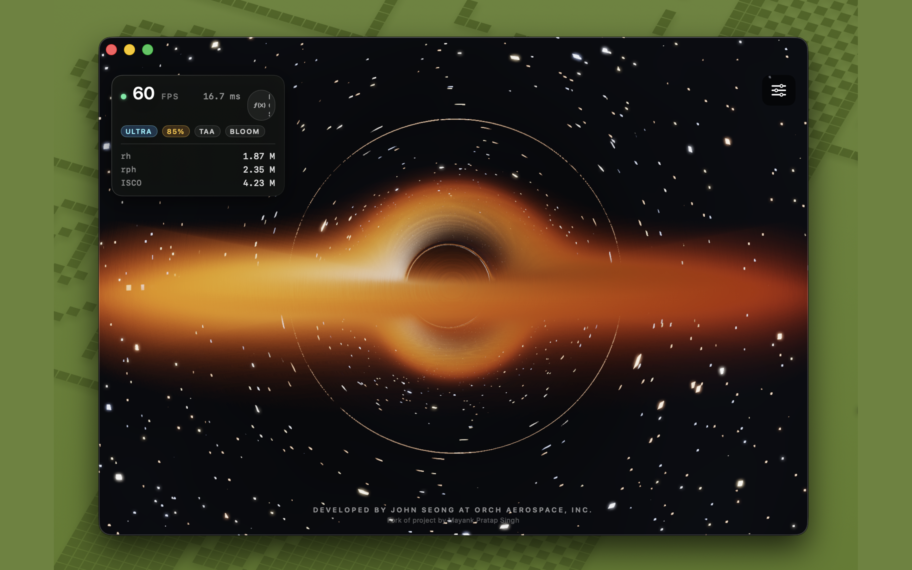
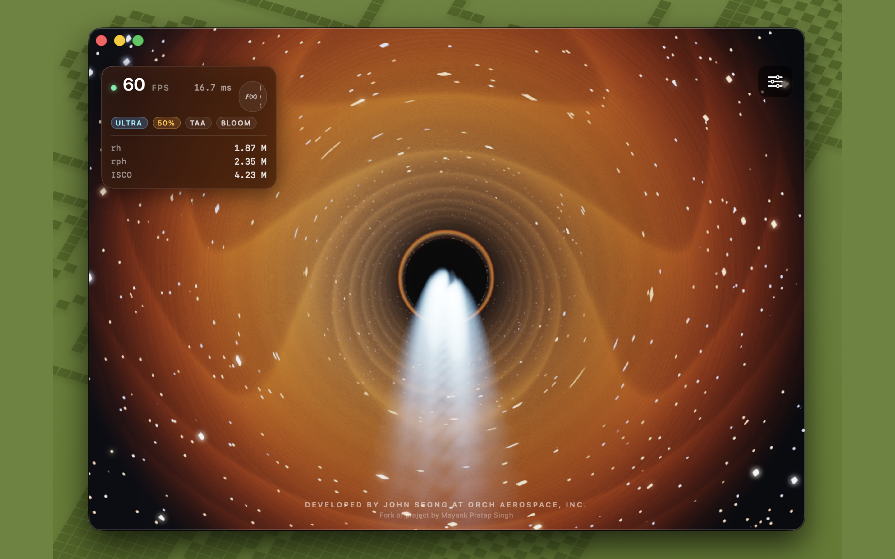
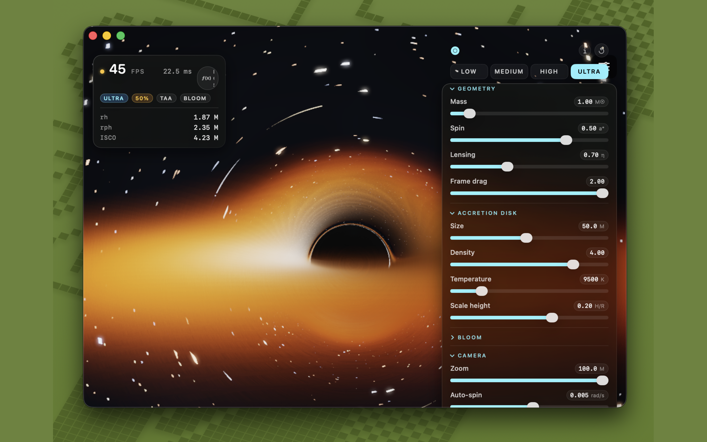
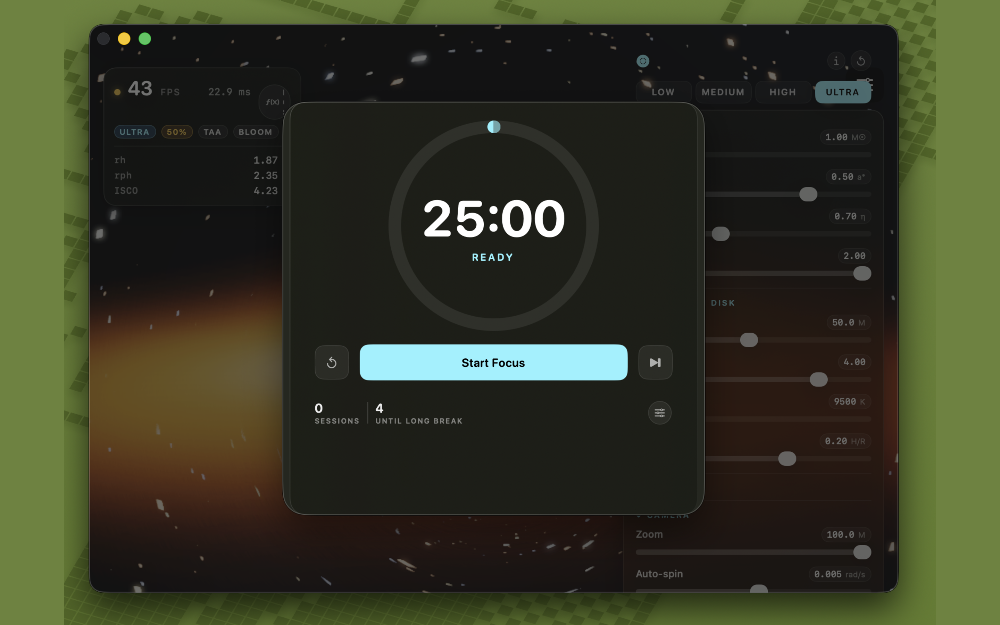
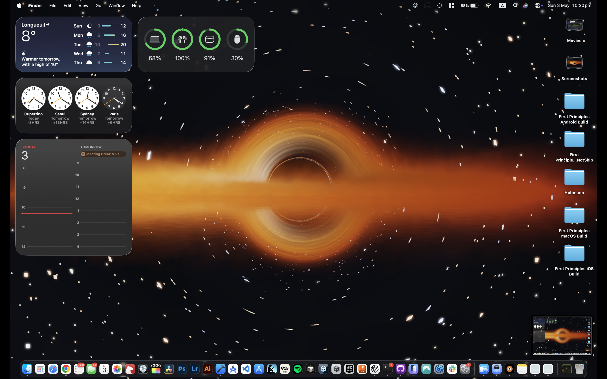

# BlackHole — Native macOS & iOS

A scientifically-accurate, real-time relativistic ray-marching engine that
solves curved-spacetime geodesics for near-extremal Kerr black holes
($a$ up to $0.999$). Written in **Swift + Metal Shading Language**, with
an optional Rust kernel (`gravitas-core`) for validated horizon /
photon-sphere / ISCO math.

The macOS build doubles as a **live desktop wallpaper** that renders
behind your windows and Finder icons. The iOS build can capture the
current frame and save it to Photos so you can set it as a still
wallpaper.

## Screenshots

| Front view | Pole view |
| :--- | :--- |
|  |  |

| Control panel | Pomodoro timer | Live wallpaper |
| :--- | :--- | :--- |
|  |  |  |

## What's in the box

| Domain         | Implementation                                                |
| :------------- | :------------------------------------------------------------ |
| **Renderer**   | Multipass HDR Metal: `scene → TAA → bright → blur → composite` |
| **Geodesics**  | Kerr-Schild Hamiltonian + Bardeen effective potential (MSL)   |
| **Disk model** | Page-Thorne with exact Doppler factor + Tanner-Helland blackbody |
| **TAA**        | Neighborhood-clamped temporal AA in YCoCg space               |
| **Tone map**   | ACES + gamma 2.2                                              |
| **Physics FFI**| Optional Rust `gravitas-ffi` xcframework (Kerr horizon, ISCO) |

Quality presets (Low / Medium / High / Ultra) tune ray steps, render
scale, TAA, and bloom independently.

## Layout

```
apple/
├── project.yml                       # XcodeGen spec
├── BlackHole/                        # Shared sources (both targets)
│   ├── BlackHoleParameters.swift     # ObservableObject for sliders + toggles
│   ├── ContentView.swift             # Drag + pinch gestures + home buttons
│   ├── ControlPanel.swift            # Sliders, preset picker, toggles
│   ├── HUDView.swift                 # FPS / r_h / r_ph / ISCO overlay
│   ├── PomodoroTimer.swift           # Focus-timer model
│   ├── PomodoroView.swift            # Ring UI + controls
│   ├── PaywallSheet.swift            # Pro upgrade flow
│   ├── SubscriptionManager.swift     # StoreKit 2 monthly subscription
│   ├── AboutSheet.swift              # Credits + version
│   ├── Scenarios.swift               # Preset Kerr configurations
│   ├── MetalView.swift               # Cross-platform MTKView wrapper
│   ├── QualityPreset.swift           # Low / Med / High / Ultra
│   ├── Bridge/
│   │   └── Gravitas.swift            # Swift ↔ gravitas-ffi shim
│   ├── Renderer/
│   │   ├── Renderer.swift            # Multipass pipeline driver
│   │   ├── BlackHole.metal           # Kerr scene fragment shader (HDR out)
│   │   └── Postprocess.metal         # TAA + bloom + composite
│   └── Shared/
│       ├── ShaderTypes.h             # Shared C struct (Swift + MSL)
│       └── BlackHole-Bridging-Header.h
│
├── BlackHole-macOS/                  # macOS target
│   ├── Info.plist
│   ├── macOSApp.swift
│   ├── AppController.swift           # Window vs. wallpaper-mode switching
│   ├── MenuBarContent.swift          # Status-bar item
│   ├── WallpaperManager.swift        # NSWindow → desktop level
│   ├── WallpaperOverlay.swift        # Behind-icons rendering
│   └── Assets.xcassets
│
├── BlackHole-iOS/                    # iOS target
│   ├── Info.plist
│   ├── iOSApp.swift
│   └── WallpaperSaver.swift          # MTKView → UIImage → Photos library
│
├── scripts/
│   └── build-gravitas-xcframework.sh # Rust → fat xcframework
│
└── screenshots/                      # App Store submission assets
```

## Build

Requires Xcode 15.4+ and [`xcodegen`](https://github.com/yonaskolb/XcodeGen)
(`brew install xcodegen`).

```bash
cd apple
xcodegen generate
open BlackHole.xcodeproj
```

CLI builds:

```bash
xcodebuild -project apple/BlackHole.xcodeproj \
           -scheme BlackHole-macOS \
           -configuration Release -destination 'platform=macOS' build

xcodebuild -project apple/BlackHole.xcodeproj \
           -scheme BlackHole-iOS \
           -configuration Release \
           -destination 'generic/platform=iOS' build
```

To run on a real iPhone, set `DEVELOPMENT_TEAM` in `project.yml` to your
Apple Developer Team ID and re-run `xcodegen generate`.

## Optional: link the validated Rust kernel

The Metal scene shader does its own geodesic integration on-GPU, so the
app runs today without Rust. To swap the Swift Bardeen formulas in
`BlackHole/Bridge/Gravitas.swift` for the validated `gravitas-core` Rust
kernel:

1. Install `rustup` (https://rustup.rs).
2. Build the xcframework:
   ```bash
   cd apple
   ./scripts/build-gravitas-xcframework.sh
   ```
   This produces `apple/build/Gravitas.xcframework`.
3. Add the framework to `project.yml` under both targets:
   ```yaml
   dependencies:
     - framework: build/Gravitas.xcframework
       embed: false
   ```
4. Add `GRAVITAS_LINKED` to each target's
   `SWIFT_ACTIVE_COMPILATION_CONDITIONS` so the bridge in
   `Bridge/Gravitas.swift` switches to the C symbols.
5. Re-run `xcodegen generate`.

## Quality presets

| Preset | Ray steps | Render scale | TAA | Bloom |
|--------|-----------|--------------|-----|-------|
| Low    | 80        | 0.6×         | off | off   |
| Medium | 160       | 0.8×         | on  | on    |
| High   | 240       | 1.0×         | on  | on    |
| Ultra  | 360       | 1.0×         | on  | on    |

## License

MIT — © 2026 John Seong / Orch Aerospace, Inc.
Forked from work by Mayank Pratap Singh.
